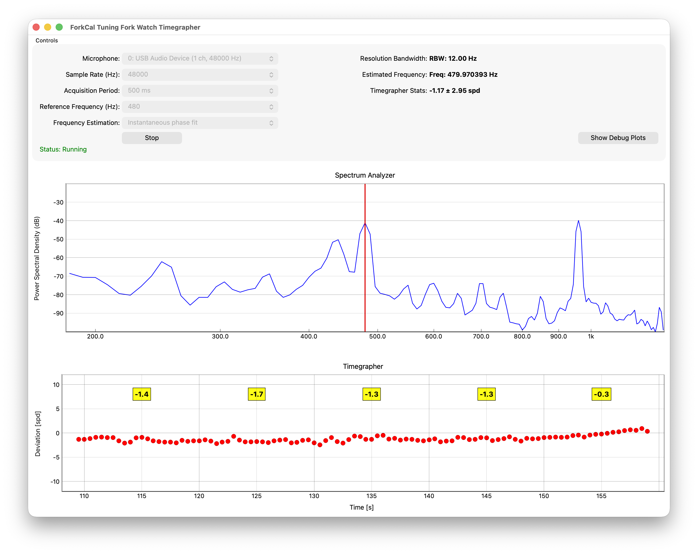

# ForkCal
Tuning fork watch timegrapher for Bulova Accutron and ETA movements, such as Omega f300, etc.

This is a fork of the original work from joncox123 implementing a new more efficient and compatible GUI using PySide6 and PyQtGraph instead of tkinter and matplotlib. The GUI has been changed to stack vertically the charts.
Additionally the 480 Hz frequency setting has been added, used by some of the last Accutron movements.

    

## Hardware Requirements
This timegrapher software is intended to be used with an *inexpensive* USB timegrapher such as those available on Amazon, AliExpress and eBay. While the performance out of the box is not terrible, there are [**a few mods that should be done to dramatically improve the performance**](timegrapher-mods.md), such as changing the crystal to a 2.5 ppm TCXO, to meet or exceed that of a professional commercial timegrapher.
- https://www.amazon.com/s?k=usb+timegrapher
- https://www.aliexpress.us/w/wholesale-usb-timegrapher.html
- https://www.ebay.com/sch/i.html?_nkw=usb+timegrapher

    

## Software Requirements
Tested on macOS and a Debian based Linux (e.g: Ubuntu) using Python 3.14, but may run on other operating systems. To run on other distributions, simply install the required packages using your package manager.

## Installation
### Linux
- `sudo apt-get install python3-pyaudio portaudio19-dev`

### macOS
Install Homebrew package manager if not already present: https://brew.sh

- `brew install portaudio`

## Launch
- `python3 -m venv venv`
- `source venv/bin/activate`
- `pip install -r requirements.txt`
- `python forkcal.py`

## Build
There is a build script using Nuitka for creating a binary executable, making it easier to launch from GUI. The script require the additional packages for Linux:
- `sudo apt-get gcc patchelf ccache`
Simply launch `build.sh` and will automatically build the correct application (macOS or Linux) into the `./dist` directory. 

## Instructions (unchanged from the original repo by joncox123)
Select the reference frequency for your movement, which is the frequency of the tuning fork. Early Accutrons run at 360 Hz, while the later ETA movements such as the Omega f300 run at 300 Hz.
Also, for good accuracy, you should set the acquisition period to the longest duration possible, such as 1 second or more. 
On some watches, the second harmonic of the oscillation frequnecy is actually stronger and clearer (higher SNR) than the fundamental mode. For example, on my Accutron 214, the signal at 2*360 Hz = 720 Hz is much stronger on my cheap USB timegrapher. Therefore, I can get better accuracy and performance by selecting a reference frequency of 720 Hz instead of 360 Hz.

## Theory of Operation
An audio signal is recorded for the acquisition period (e.g. 250 ms). A spectrogram is displayed but is not part of the timegrapher calculation. Instead, the frequency estimate is performed by:

### Instantaneous frequency estimation (preferred)
- Bandpass filters the recorded signal around the reference frequency using a high order FIR filter
- Crop the filtered signal to ~15% to ~85% of the time duration.
- Compute Hilbert transform on the filtered and cropped signal to yield the complex "analytic signal"
  - The purpose of the Hilbert transform is to provide a complex signal where the real part is the original signal and the imaginary part is phase shifted by 90 degrees. This I and Q signal (in-phase and quadrature) signal allows us to determine the angle (e.g. arctan2) without ambiguity.
- Compute the angle on the analytic signal and then unwrap the phase
- Fit a line to the unwrapped phase of form φ(t) = 2πf*t + φ₀. The slope, f, is the instantaneous frequency estimate.
- Compute the frequency deviation (error) between the fit and the reference frequency, deltaF = f_ref - f_fit
- Convert frequency deviation to error in seconds per day as: SPD = deltaF/f_ref * 24*60^2
- A moving average filter of length 10 is applied to the timegrapher plot.

### Sine best fit
- Bandpass filters the recorded signal around the reference frequency using a high order FIR filter
- Crop the filtered signal to ~15% to ~85% of the time duration.
- Fit a sine wave of the form Asin(2*pi*f_fit + phi) to the filtered and cropped signal.
  - Residual fitting error in excess of 5% raises an error and the fit and measurement are discarded.
- Compute the frequency deviation (error) between the fit and the reference frequency, deltaF = f_ref - f_fit
- Convert frequency deviation to error in seconds per day as: SPD = deltaF/f_ref * 24*60^2
- A moving average filter of length 10 is applied to the timegrapher plot.

The accuracy is determined by three factors, the acquisition period (longer the better), the signal to noise ratio (SNR) of the recording circuit and the time stability of the crystal in the USB timegrapher. Even though the USB timegrapher is cheap, is still has at least a basic quartz crystal, probably around 20 ppm or 1.7 seconds per day (spd). It may be possible to improve this by soldering in an OCXO or higher quality TCXO. This is a future project. 

Regarding the SNR of the USB timegrapher, I noticed that the flashing red LED generates an electrical noise that is picked up. Cutting the LED leads eliminates this noise and can improve performance. Placing the device in a quite room or inside an insulated box can reduce ambient noise. 

## Credits and License
Developed by joncox123 using Claude AI. All rights reserved. 
Refactored by maxvalle using Claude AI. All rights reserved.
